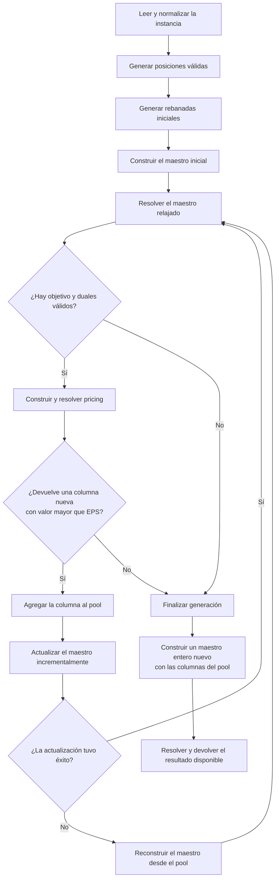

# Algoritmo de generación de columnas

## Alcance y estado de esta descripción

El problema estudiado es el Manufacturer's Pallet Loading Problem (MPLP): un único bin rectangular, ítems rectangulares idénticos, rotación de 90° permitida y maximización de la cantidad de ítems ubicados. La cota de cantidad utilizada por el algoritmo proviene del cociente de áreas, no del óptimo de referencia del catálogo.

Esta descripción fue contrastada el **8 de octubre de 2026** con el código del commit `f2c05ba`. Los resultados de diagnóstico fechados más abajo son observaciones de esa revisión; los cambios de versión, parámetros o trayectoria del solver pueden producir otro pool.

## Flujo del algoritmo base

`USE_PRACTICAL_CG_ENHANCEMENTS` vale `False` por defecto. El diagrama describe ese flujo; los mecanismos opcionales se detallan en una sección propia.



El maestro LP se conserva entre iteraciones. `IncrementalMasterModel.add_slice` agrega la variable de una rebanada, sus coeficientes en filas existentes y las filas de las celdas nuevas que ocupa. Si una actualización falla, el orquestador descarta el maestro posiblemente modificado en forma parcial y lo reconstruye a partir del pool completo. El maestro entero final se construye de nuevo.

### Trazabilidad del código

| Responsabilidad | Archivo y funciones o clases |
|---|---|
| Instancia y proceso con límite temporal | [column_generation_solver.py](../models/column_generation/column_generation_solver.py): `execute_with_time_limit`, `orchestrator` |
| Normalización, alto y cota por área | [orchestrator_services.py](../models/column_generation/orchestrator_services.py): `ProblemNormalizer`, `calculate_slice_height`, `calculate_physical_item_bound` |
| Posiciones para ambas orientaciones | [position_generator.py](../models/common/position_generator.py): `generate_positions_xym` |
| Pool inicial y registro de firmas | `orchestrator_services.py`: `InitialSliceGenerator.generate`, `SliceRegistry`, `build_slice_signature` |
| Construcción y actualización del maestro | [master_problem.py](../models/column_generation/master_problem.py): `MasterModelBuilder`, `IncrementalMasterModel` |
| Resolución LP/IP y extracción de duales | `master_problem.py`: `MasterSolver`, `DualExtractor` |
| Construcción y resolución del pricing | [slave_problem.py](../models/column_generation/slave_problem.py): `SlaveModelBuilder`, `SlaveSolver`, `SlaveSolutionMapper` |
| Cortes opcionales | `orchestrator_services.py`: `SlaveCutManager` |
| Conversión de coordenadas para la salida | `orchestrator_services.py`: `SolutionMapper.denormalize` |

```text
execute_with_time_limit(instance)
└─ orchestrator(ConfigData)
   ├─ normalizar dimensiones
   ├─ generate_positions_xym
   ├─ generate_initial_slices → SliceRegistry
   ├─ construir maestro inicial
   ├─ repetir: actualizar maestro → resolver LP → duales → pricing
   │  └─ aceptar columna, aplicar mecanismos opcionales o detener
   └─ construir y resolver maestro entero → desnormalizar la solución
```

La generación de posiciones requiere `bin_width >= bin_height` e `item_width >= item_height`. El orquestador normaliza las dimensiones antes de llamarla y transforma la solución de vuelta para su salida.

## Definición y representación de rebanada

Una rebanada agrupa ítems cuyos puntos iniciales están dentro de una misma ventana horizontal de ancho `W`, igual al ancho del bin, y alto nominal `hr`. Sus ítems pueden sobresalir por arriba de la ventana, respetando los límites del bin.

El pricing selecciona a lo sumo una base `y_base` y exige, para cada ítem elegido:

```text
y_base <= y_inicial < y_base + hr
```

El borde superior se excluye mediante la comparación estricta de coordenadas enteras. Esta condición geométrica no utiliza el `EPS` del criterio de costo reducido. Además, el pricing limita el tamaño completo de cada ítem al bin y evita solapamientos por celda.

`calculate_slice_height` usa como objetivo inicial el 5% de la cota por área, estima las filas necesarias en cada orientación y toma el menor alto obtenido. Para `50 x 20 / 13 x 8`, el alto nominal es `8`.

### Representación interna

[Slice.py](../objects/Slice.py) almacena:

- identificador, ancho y alto nominal;
- lista de ítems;
- puntos iniciales de los ítems.

Cada ítem contiene dimensiones, orientación y una posición absoluta `(x,y)` en el sistema de coordenadas del bin. `Slice` no guarda un origen propio ni la variable `y_base` seleccionada en el pricing. El contorno ocupado puede ser mayor que el rectángulo nominal de la ventana.

El maestro selecciona rebanadas que ya vienen ubicadas; no decide dónde desplazarlas. Dos disposiciones relativas iguales a distinta altura son columnas distintas.

## Maestro y señal dual

Para el pool actual `S`, el maestro maximiza:

```text
sum(cantidad_de_items(s) * p_s, s en S)
```

Para cada celda cubierta por al menos una columna del pool agrega:

```text
sum(p_s, s que cubre la celda (x,y)) <= 1
```

La ocupación de cada columna es la unión de las celdas de sus ítems. El coeficiente por columna y celda es `1`. Las variables se construyen binarias, con cotas `0` y `1`, y se convierten a continuas al resolver el LP. En el maestro entero final son binarias.

`DualExtractor` transforma `consItem_x_y` en `dual_prices["pi"]["(x,y)"]`. El pricing usa precio cero para una celda sin entrada dual. El contrato de nombres debe conservarse entre ambos modelos.

Varias celdas pueden tener la misma incidencia entre columnas. Esa redundancia permite soluciones duales muy concentradas. En la inicialización del caso `50 x 20 / 13 x 8` se verificó:

```text
pi(0,0) = 3
pi(0,8) = 3
resto = 0
```

La concentración puede favorecer columnas que evitan unas pocas celdas caras. Es evidencia de degeneración, pero no prueba por sí sola que la solución entera vaya a ser subóptima.

## Pricing, firmas y criterio de aceptación

El pricing tiene variables binarias de ubicación `z_x_a_b` y `z_y_a_b`. Su objetivo es:

```text
valor(s) = cantidad_de_items(s) - suma_de_duales_de_sus_celdas_ocupadas
```

Cada ubicación aporta `1 - suma(pi de las celdas que ocupa)`. Como los ítems de una columna no se solapan, la suma de estos coeficientes coincide con el valor de la columna calculado a partir de su ocupación.

El flujo base devuelve una solución del pricing por iteración. Acepta una columna nueva si su valor es mayor que `EPS = 1e-9`. La firma es la tupla ordenada de `(x,y,rotado)` de sus ítems; no depende de sus identificadores.

El flujo base se detiene cuando:

- no dispone de objetivo LP y duales válidos;
- el pricing no devuelve una solución factible;
- el valor devuelto por el pricing es menor o igual a `EPS`;
- devuelve una columna duplicada con valor positivo;
- no genera una rebanada utilizable.

Un duplicado no se agrega al pool. Cuando las heurísticas están desactivadas, no se busca otra columna después de ese duplicado.

### Alcance de las condiciones de parada

La ausencia de columnas mejorantes certifica el cierre del LP completo solamente si el pricing correspondiente está resuelto con una prueba suficiente y cubre el universo de columnas considerado. El código actual permite devolver un incumbente factible de pricing aunque la resolución termine por límite.

Si ese incumbente tiene valor no positivo, el orquestador puede detenerse sin consultar una cota que descarte otras columnas positivas. Conserva el estado de terminación anormal; ese resultado no debe interpretarse como prueba de convergencia LP. Tampoco el corte por duplicado o por estancamiento constituye esa prueba.

## Heurísticas opcionales y estabilización

El argumento `finalization_heuristics` puede sobrescribir `USE_PRACTICAL_CG_ENHANCEMENTS`. El runner de benchmarks pasa explícitamente `False`, incluso si se cambia el flag global.

| Mecanismo | Base, flag desactivado | Con heurísticas activadas |
|---|---|---|
| Duplicado positivo | Detener | Hasta `MAX_EXTRA = 5` intentos de encontrar una alternativa nueva positiva |
| Valor menor o igual a `EPS` | Detener | Hasta 5 intentos extra, forzando columnas no vacías y rechazando valores menores que `-EPS` |
| Segunda fase del pricing | Desactivada | Mantener el objetivo original dentro de `1e-8` y maximizar cantidad de ítems; devolverla si aumenta la cardinalidad |
| Estancamiento LP | Sin ese corte | Detener tras `MAX_STAGNATION = 1000` iteraciones con mejora absoluta menor o igual a `EPS_MASTER = 1e-4` |

La exploración adicional termina la generación después de esos intentos. No es una enumeración exhaustiva de columnas y no garantiza un pool suficiente para el óptimo entero.

La estabilización usa un flag independiente, `USE_DUAL_STABILIZATION = False`, con `ALPHA_DUAL_STABILIZATION = 0.2`. Pasar `finalization_heuristics=False` evita también su aplicación. Activar las heurísticas prácticas no activa automáticamente la estabilización.

### Alcance real de los no-good cuts

`SlaveCutManager` agrega, para un conjunto de variables activas `A`:

```text
sum(z_i, i en A) <= len(A) - 1
```

Esto excluye la solución original y todos sus superconjuntos: obliga a quitar al menos una ubicación de `A`, aunque se agreguen otras ubicaciones. Por lo tanto, el corte implementado es más fuerte que excluir únicamente una solución exacta.

En el diagnóstico se verificó que cortar los tres NR en `(0,0)`, `(13,0)` y `(26,0)` impide también generar la columna que conserva esos tres y agrega el rotado en `(39,0)`. Este alcance afecta a la exploración opcional y debe considerarse al interpretar sus resultados. El algoritmo base no agrega estos cortes.

## Inicialización actual y alternativa de Marcelo

`InitialSliceGenerator.generate` es la inicialización activa. Construye rebanadas homogéneas para las alturas disponibles en las posiciones de cada orientación.

`generate_initial_slices_greedy_uniform`, mediante `InitialSliceGenerator.generate_greedy_uniform`, implementa la alternativa incorporada en el commit `70250d5`. Construye filas homogéneas con pasos iguales al ancho y alto de cada orientación. Está disponible en el código, pero el orquestador actual no la llama; tampoco hay un selector CLI para activarla.

La alternativa sólo cambia el pool inicial. No modifica `generate_positions_xym`, la definición de rebanada, el pricing ni el maestro. Puede omitir columnas ubicadas en alturas que sí están disponibles para pricing.

Ejemplo verificado con `40 x 25 / 10 x 6`:

| Inicialización | Cantidad de columnas | Alturas iniciales de columnas rotadas |
|---|---:|---|
| Actual | 10 | `0, 6, 10, 12` |
| Greedy uniforme | 6 | `0, 10` |

La posición rotada `(0,6)` sigue disponible en pricing. Una columna omitida puede recuperarse si el pricing la selecciona; su factibilidad no garantiza que sea atractiva para los duales ni que llegue al pool.

En `50 x 20 / 13 x 8`, ambas inicializaciones producen las mismas tres columnas. En ese caso un rotado no puede comenzar en `y=8`, porque `8 + 13 > 20`. La reducción de seeds de la alternativa no explica ese caso concreto.

## Diagnóstico del caso `50 x 20 / 13 x 8`

### Identidad e historia

La instancia tiene esperado `7` en [instances.py](../instances.py). Es `case7` en el catálogo y en [test_orchestrator.py](../tests/test_orchestrator.py), pero `case8` en [test_feasibility.py](../tests/test_feasibility.py). Las pruebas de factibilidad tienen un numerado propio; para relacionar resultados debe compararse la geometría, no sólo la etiqueta.

La configuración histórica del commit `463d9fd`, cuyo mensaje describe el epsilon dinámico, ya contiene `50 x 20 / 13 x 8` con esperado `7`. Es evidencia de reutilización de la instancia bajo versiones posteriores. Un arreglo histórico no acredita su resultado en todas las versiones siguientes.

El comportamiento `LP = 7 / IP = 6` se había observado con reconstrucción del maestro. El maestro incremental se incorporó en el commit `b2b4546`; ese cambio puede alterar la trayectoria de duales y columnas aun manteniendo la formulación del maestro.

### Columna mixta de referencia

Una columna útil es:

```text
[(0,0,NR), (13,0,NR), (26,0,NR), (39,0,R)]
```

Es compatible con la columna superior de tres NR en `(0,8)`, `(13,8)` y `(26,8)`. Sus ubicaciones existen en pricing y la columna es factible si se fuerza.

Con los duales iniciales verificados:

```text
fila inferior de 3 NR: valor = 0
rotado adicional en (39,0): aporte = +1
columna mixta de 4: valor = +1
mejor columna inicial devuelta por pricing: 5 rotados, valor = +5
```

La mixta mejora a la fila de tres, pero no es la mejor columna para esos duales. No apareció entre las primeras 12 alternativas exploradas con los cortes implementados. Esa exploración acotada no prueba que nunca pueda aparecer.

### Verificación del 8 de octubre de 2026

Se utilizó CPLEX 22.1.1, con las heurísticas desactivadas. Las comprobaciones se realizaron en memoria, sin exportar gráficos ni cambiar el código. La comparación completa tuvo un límite externo de 45 segundos y límites de 5 segundos por resolución.

Para comparar la reconstrucción se activó en memoria la ruta de respaldo existente en cada actualización; no se ejecutó un checkout histórico.

| Comprobación | LP | IP | Columnas nuevas |
|---|---:|---:|---:|
| Pool inicial | 6 | 6 | 0 |
| Pool inicial más la mixta de referencia | No medido | 7 | Incorporación manual |
| Flujo incremental actual | 7 | 7 | 14 |
| Reconstrucción en cada actualización | Aproximadamente 7 | 6 | 20 |
| Pool anterior más la mixta de referencia | No medido | 7 | Incorporación manual |

Los maestros enteros de estas comprobaciones finalizaron con estado CPLEX `101`. Se comprobó la geometría de las soluciones obtenidas. Son resultados observados en esas corridas, no garantías sobre futuras trayectorias.

El flujo incremental obtuvo siete ítems con estas columnas:

```text
Inferior: [(0,0,NR), (13,0,R), (24,0,NR), (37,0,NR)]
Superior: [(0,8,NR), (24,8,NR), (37,8,NR)]
```

La mixta de referencia no estaba en ese pool. Es útil para alcanzar siete, pero no es indispensable: otra disposición mixta puede ser compatible con otra columna superior.

### Interpretación

La comparación reproduce un pool con LP de valor siete e IP restringido óptimo de seis. Agregar la mixta aumenta el IP a siete, lo que acredita insuficiencia de ese pool. No se encontró un bloqueo geométrico de la mixta ni una incapacidad general del pricing para mezclar orientaciones.

El éxito del flujo incremental en esta instancia no elimina la limitación general. La concentración dual y los desempates pueden influir en el pool; no se ha establecido que una de esas causas explique por sí sola todos los fallos.

## LP, entero restringido y benchmarks

El maestro entero final sólo utiliza las columnas del pool generado. No se ejecuta pricing dentro de sus ramas: el programa no implementa branch-and-price.

Un LP restringido de valor `40` y un IP restringido óptimo de `36`, frente a una referencia válida de `40`, puede indicar que las columnas alcanzan para una combinación fraccionaria pero faltan para una combinación entera. Columnas sin utilidad adicional para el LP pueden ser necesarias para el entero, como se explica en [Lübbecke y Desrosiers, sección 5.3.2](https://or.rwth-aachen.de/files/research/publications/cgsurvey.pdf).

Antes de atribuir un caso a insuficiencia del pool se debe comprobar que el IP restringido realmente se resolvió óptimamente, que las columnas son factibles y que LP e IP se refieren al pool que se está analizando. Un incumbente inferior por timeout no basta para esa conclusión.

En los seis CSV de resultados revisados el 8 de octubre no se encontró una fila con ambos objetivos numéricos que acreditara esa brecha en benchmarks. Varias filas tienen LP igual a la referencia e IP `NA` por timeout o interrupción. Esas filas documentan una corrida incompleta, no un IP numéricamente subóptimo. La interpretación de métricas y estados está en [benchmark_paver.md](benchmark_paver.md).

## Relación entre las líneas de trabajo

| Ticket | Alcance y relación |
|---|---|
| A: definición de rebanada y casos problemáticos | Mantener la trazabilidad geométrica y distinguir un defecto de representación de la insuficiencia del pool entero. Actualizar la reproducción a la versión que se evalúa. |
| B: inicialización alternativa | Comparar pools iniciales manteniendo posiciones, formulaciones y flags, salvo que Marcelo indique otro alcance. Puede influir en las columnas recuperadas posteriormente. |
| C: benchmarks | Medir A y B, distinguiendo brecha numérica, resolución incompleta y coincidencia con la referencia. Puede ejecutarse antes de resolver los otros tickets. |

Conviene mantenerlos separados por sus criterios de aceptación. C aporta evidencia para A y permite evaluar B; una observación pendiente de diagnóstico no exige bloquear toda la medición. Los casos detectados mediante gráficos deben vincularse con A cuando comparten una reproducción concreta.

Las decisiones pendientes de Marcelo son el alcance de la inicialización alternativa, el objetivo de calidad heurística o garantía de óptimo entero, el papel del enriquecimiento del pool y el presupuesto experimental reservado para el maestro entero. Las variantes de maestro, estabilización, enriquecimiento y branch-and-price son líneas de estudio; esta revisión documental no las implementa ni establece una solución elegida.
